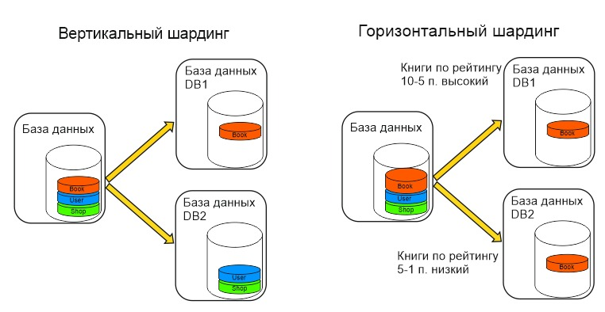

## Домашнее задание к занятию "Репликация и масштабирование. Часть 2" - Карих Елена
---
### Задание 1

Опишите основные преимущества использования масштабирования методами:
- активный master-сервер и пассивный репликационный slave-сервер;
- master-сервер и несколько slave-серверов;
- активный сервер со специальным механизмом репликации — distributed replicated block device (DRBD);
- SAN-кластер.

Дайте ответ в свободной форме.

### Решение 1

<ins>Активный master-сервер и пассивный репликационный slave-сервер:</ins>
- Высокая доступность: Мастер-сервер обеспечивает активное чтение и запись данных, а репликационные slave-серверы могут использоваться для балансировки нагрузки и отказоустойчивости.
- Производительность: При использовании репликационных серверов можно распределить нагрузку на чтение, что увеличивает производительность.
- Резервное копирование: Репликационные серверы могут использоваться для резервного копирования без воздействия на мастер-сервер.

<ins>Master-сервер и несколько slave-серверов:</ins>
- Отказоустойчивость и так же высокая доступность: Несколько репликационных slave-серверов обеспечивают увеличенную отказоустойчивость и улучшенную доступность.
- Балансировка нагрузки: Распределение запросов между несколькими slave-серверами позволяет улучшить производительность и балансировать нагрузку.

<ins>Активный сервер с DRBD:</ins>
- Синхронная репликация: DRBD обеспечивает синхронную репликацию данных между активным сервером и пассивным сервером, что гарантирует целостность данных.
- Высокая доступность: DRBD может использоваться для обеспечения отказоустойчивости и быстрого восстановления в случае сбоев.

<ins>SAN-кластер:</ins>
- Централизованное хранилище: SAN-кластер предоставляет централизованное хранилище, что делает его удобным для больших и сложных сред.
- Производительность: SAN-кластеры могут предоставлять высокую производительность благодаря использованию высокоскоростных соединений и хранилища.

---
### Задание 2

Разработайте план для выполнения горизонтального и вертикального шаринга базы данных. База данных состоит из трёх таблиц:
- пользователи,
- книги,
- магазины (столбцы произвольно).

Опишите принципы построения системы и их разграничение или разбивку между базами данных.
Пришлите блоксхему, где и что будет располагаться. Опишите, в каких режимах будут работать сервера.

### Решение 2

Шардинг позволяет перераспределить нагрузку, создаваемую запросами между различными серверами, за счет выноса данных некоторых модулей в отдельнгую базу данных. 
Учитывая задание, можно представить что это что-то по типу онлайн магазина книг, книг огромное количество и таблица может включать в себя много разных нужных полей, поэтому при конфигурации с вертикальным шардингом - я вынесла на отдельный сервер таблицу "book" и на второй сервер группу таблиц "user", "shop" (зарегистрированный пользователь - это уже покупатель, скорее всего будет много запросов на чтение еще до регистрации)
При конфигурации с горизонтальным шардингом я так же разделила таблицу "book" на разные сервера по рейтингу, хотя уже думаю, надо было делить по ФИО автора что ли, а то получается нагрузка будет не сбалансирована(((
 

---
